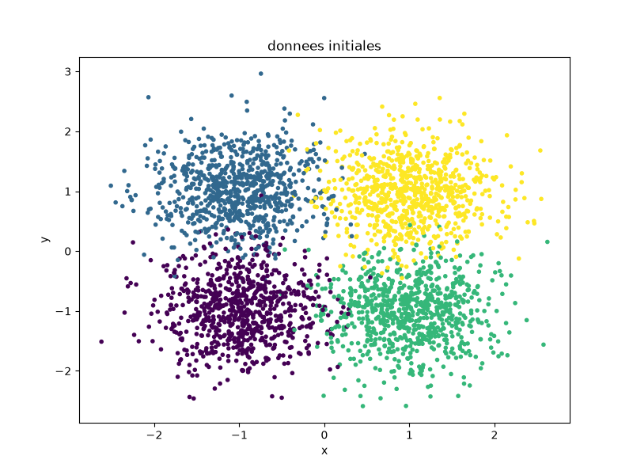
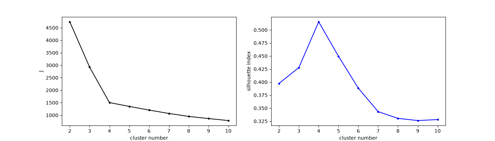

# Clustering Algorithms Exploration

Exploration and comparison of different Machine Learning clustering algorithms on various types of datasets.

---


*Example of a synthetic dataset generated to test clustering algorithms.*

---

## Overview & Goals

- **Algorithm Exploration**: Test and compare the behavior of different clustering algorithms (K-Means, Agglomerative Clustering, Spectral Clustering, DBSCAN, MeanShift).
- **Data Generation**: Create datasets with different topologies (Gaussians, Moons, Uniform, Unbalanced, Circles) to evaluate model robustness.
- **Hyperparameter Optimization**: Automatically find the best parameters (number of clusters, `eps`, `min_samples`, `bandwidth`) by maximizing the silhouette score.
- **Performance Evaluation**: Measure the quality of the resulting partitions using the Adjusted Rand Index (ARI).

---

## Technical Stack

- **Language**: Python 3
- **Machine Learning**: Scikit-Learn
- **Scientific Computing**: NumPy
- **Data Visualization**: Matplotlib

---

## Key Features

- **Varied Synthetic Data Generation**: Blobs (Gaussians), Moons, concentric circles, and uniform data.
- **Detailed K-Means**: Step-by-step visualization of centroid movement and objective function (inertia) evolution during early iterations.
- **Optimal Cluster Determination**: Combined use of the elbow method (inertia) and the silhouette index.
- **Automated Benchmark**: Looped execution of several clustering algorithms across various datasets, with parameter search and ARI score calculation.

---

## Development Steps & Detailed Explanations

### 1. Initial Data Generation
To start, we created a synthetic dataset composed of four 2D Gaussians. Each Gaussian is centered on distinct coordinates ((-1, -1), (-1, 1), (1, -1) and (1, 1)) with a standard deviation of 0.5. We generated 800 points per Gaussian, totaling 3200 points.

- [x] Generate synthetic data (4 Gaussians, 800 points each).

### 2. Finding the Optimal Number of Clusters
We used the elbow method on inertia ($J$) and the silhouette index to determine the ideal number of clusters for our dataset (k ranging from 2 to 10).



- [x] Find the optimal number of clusters via K-Means (Inertia and Silhouette).

### 3. K-Means Algorithm Evolution
By fixing the number of clusters to 4 and using specific centroid initialization, we observe the movement of centers and the decrease of inertia over the first 4 iterations.


- [x] Evolution of the objective function at each iteration.

### 4. Supervised Evaluation with ARI
We use the supervised validation metric Adjusted Rand Index (ARI) to evaluate the quality of our final partition (by comparing it with the true labels of the dataset). The obtained ARI helps validate that K-Means is functioning correctly.

- [x] Calculate the Adjusted Rand Index (ARI).

### 5. Algorithm Comparison

We ran different algorithms (KMeans, Agglomerative, Spectral, DBSCAN, MeanShift) on various datasets generated with Scikit-Learn: Gaussians, Moons, Uniform data, Unbalanced Gaussians, and Circles.
The parameters for each algorithm were automatically tuned to maximize the silhouette score before evaluating the final partition quality using the ARI.

#### Results Analysis

*   **DBSCAN** is more effective on datasets with complex geometric shapes like **Moons**. It is capable of detecting non-convex structures.
*   **KMeans, Agglomerative, and MeanShift** perform well on **Gaussians** (globular clusters), which is what they are designed for.
*   **Spectral Clustering** is robust, achieving good scores on Gaussians and performing slightly better on unbalanced classes than KMeans.
*   On **uniform data** where no real clusters exist, all algorithms get an ARI close to 0 (clustering makes no sense here, which is the expected behavior).
*   For **circles** (a Gaussian inside a circle), scores are very close for all algorithms. Density-based algorithms (like DBSCAN) require careful parameterization (`eps` and `min_samples`) to separate this kind of topology, hence the sensitivity shown in the table.

---

## Benchmark: Algorithm Comparison

Here is the table of the obtained ARI scores:

| Dataset | KMeans | Agglomerative | Spectral | DBSCAN | MeanShift |
|---|---|---|---|---|---|
| Gaussians | 0.8901 | 0.8296 | 0.8961 | 0.5620 | 0.8834 |
| Moons | 0.3049 | 0.2930 | 0.2844 | 0.9850 | 0.3650 |
| Uniform | 0.0003 | 0.0015 | 0.0015 | 0.0038 | 0.0089 |
| Unbalanced | 0.6776 | 0.5789 | 0.8119 | 0.8110 | 0.7117 |
| Circles | 0.5825 | 0.5865 | 0.5828 | 0.5811 | 0.5679 |

---

## Quick Start

### Running the Project

```bash
# Install required dependencies (if not already done)
# pip install numpy matplotlib scikit-learn

# Run the main script to generate plots and launch the comparison
python clustering.py
```
