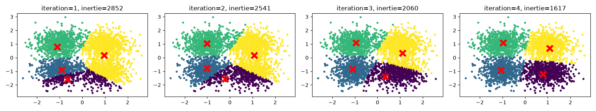

# Exploration des algorithmes de Clustering

Ce dépôt vise à explorer et comparer différents algorithmes de clustering en Machine Learning.

## Avancement

### 1. Génération des données initiales
Pour commencer, nous avons créé un jeu de données synthétique composé de quatre gaussiennes en 2D. Chaque gaussienne est centrée sur des coordonnées distinctes ((-1, -1), (-1, 1), (1, -1) et (1, 1)) et possède un écart-type de 0.5. Nous avons généré 800 points par gaussienne, pour un total de 3200 points.

- [x] Génération de données synthétiques (4 gaussiennes, 800 points chacune).

### 2. Trouver le nombre de classes optimal
Nous avons utilisé la méthode du coude sur l'inertie ($J$) et l'indice de silhouette pour déterminer le nombre idéal de clusters sur notre jeu de données (k allant de 2 à 10).

- [x] Trouver le nombre de classes optimal via K-Means (Inertie et Silhouette).

### 3. Évolution de l'algorithme K-Means
En fixant un nombre de clusters à 4 et une initialisation spécifique des centroïdes, nous observons le déplacement des centres et la diminution de l'inertie sur les 4 premières itérations.

- [x] Évolution de la fonction objectif à chaque itération.

### 4. Évaluation supervisée avec ARI
Nous utilisons la métrique de validation supervisée Adjusted Rand Index (ARI) pour évaluer la qualité de notre partition finale (en la comparant avec les vraies étiquettes du jeu de données). L'ARI obtenu permet de valider le bon fonctionnement de K-Means.

- [x] Calcul de l'Adjusted Rand Index (ARI).

### 5. Comparaison des algorithmes

Nous avons exécuté différents algorithmes (KMeans, Agglomerative, Spectral, DBSCAN, MeanShift) sur différents jeux de données générés avec Scikit-Learn : Gaussiennes, Lunes (Moons), Données uniformes, Gaussiennes non équilibrées et Cercles.
Les paramètres de chaque algorithme ont été cherchés automatiquement pour maximiser le score de silhouette avant d'évaluer la qualité de la partition finale avec l'ARI.

Voici le tableau des scores ARI obtenus :

| Dataset | KMeans | Agglomerative | Spectral | DBSCAN | MeanShift |
|---|---|---|---|---|---|
| Gaussiennes | 0.8901 | 0.8296 | 0.8961 | 0.5620 | 0.8834 |
| Moons | 0.3049 | 0.2930 | 0.2844 | 0.9850 | 0.3650 |
| Uniform | 0.0003 | 0.0015 | 0.0015 | 0.0038 | 0.0089 |
| Unbalanced | 0.6776 | 0.5789 | 0.8119 | 0.8110 | 0.7117 |
| Circles | 0.5825 | 0.5865 | 0.5828 | 0.5811 | 0.5679 |

#### Analyse des résultats

*   **DBSCAN** est plus efficace sur les jeux de données avec des formes géométriques complexes comme les **Lunes (Moons)**. Il est capable de détecter les structures non convexes.
*   **KMeans, Agglomerative et MeanShift** donnent de bons résultats sur les **Gaussiennes** (clusters globulaires), ce pour quoi ils sont conçus.
*   **Spectral Clustering** est robuste, obtenant de bons scores sur les Gaussiennes et s'en sortant un peu mieux sur les classes non équilibrées que KMeans.
*   Sur des **données uniformes** où il n'y a pas de clusters réels, tous les algorithmes obtiennent un ARI proche de 0 (le regroupement n'a pas de sens, ce qui est le comportement attendu).
*   Pour les **cercles** (une gaussienne dans un cercle), les scores sont très proches pour tous les algorithmes. Les algorithmes de densité (comme DBSCAN) nécessitent une bonne paramétrisation (`eps` et `min_samples`) pour séparer ce type de topologie, d'où la sensibilité montrée dans le tableau.
